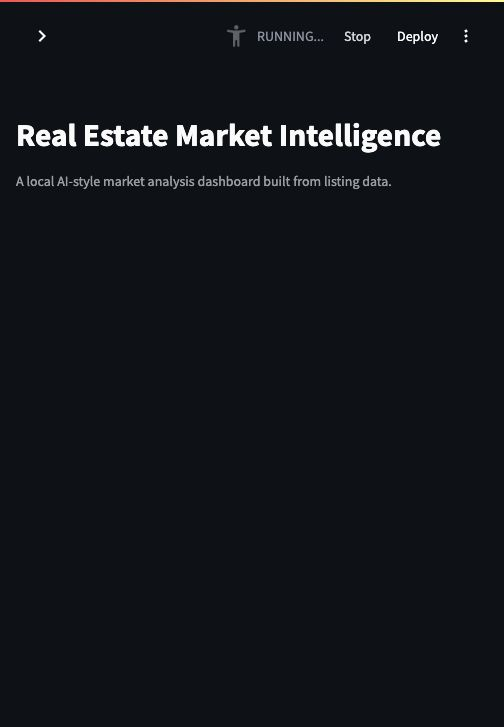

# Real Estate Market Intelligence

A Python market-intelligence dashboard that turns real-estate listing data into investor-focused metrics, insight cards, and an executive report.

Version 1 uses a local sample dataset so the full workflow is easy to run, inspect, and explain. Future versions will add cached real-estate API ingestion and LLM-generated recommendations.



## Project Overview

The project follows a simple analytics pipeline:

```text
raw listings CSV
-> clean and enrich data
-> calculate market signals
-> generate insight cards
-> create executive report
-> show Streamlit dashboard
```

It answers questions such as:

- Which neighborhoods have the strongest rental yield?
- Which markets are moving fastest?
- Which areas have the highest price per square foot?
- Where might buyers have negotiation leverage?

## Features

- Cleans raw real-estate listing data with Pandas
- Calculates `price_per_sqft`, rental yield, and market-speed labels
- Generates rule-based market intelligence insights
- Writes an executive Markdown report
- Displays KPIs, filters, charts, and insight cards in Streamlit
- Includes Docker support for reproducible local runs

## Tech Stack

- Python
- Pandas
- Streamlit
- Plotly
- Docker

## Repository Structure

```text
real_estate_market_intelligence/
  data/
    raw/listings.csv
    processed/
  src/
    real_estate_intelligence/
      ingest/data_cleaner.py
      engine/market_analyzer.py
      serve/report_generator.py
  app.py
  run.py
  requirements.txt
  Dockerfile
  docker-compose.yml
```

## Data

Version 1 uses a sample CSV dataset:

```text
data/raw/listings.csv
```

Each row represents one listing with fields such as:

- city
- neighborhood
- property type
- bedrooms and bathrooms
- square footage
- list price
- estimated monthly rent
- days on market
- year built
- listing status

The cleaning step enriches the dataset with:

- `price_per_sqft`
- `monthly_rent_yield`
- `annual_rent_yield_pct`
- `market_speed`

## Local Setup

Create a virtual environment and install dependencies:

```bash
python3 -m venv .venv
.venv/bin/python -m pip install -r requirements.txt
```

Run the pipeline:

```bash
.venv/bin/python run.py
```

This creates:

```text
data/processed/clean_listings.csv
market_insights.json
executive_report.md
```

Start the dashboard:

```bash
.venv/bin/streamlit run app.py
```

Open:

```text
http://127.0.0.1:8501
```

## Docker

Build and run with Docker Compose:

```bash
docker compose up --build
```

The dashboard will be available at:

```text
http://127.0.0.1:8502
```

## How The Pipeline Works

`run.py` is the project entry point. It calls three stages:

1. `data_cleaner.py`
   Loads the raw CSV, validates columns, converts numeric fields, calculates real-estate metrics, and writes the processed CSV.

2. `market_analyzer.py`
   Groups the cleaned listings by city and neighborhood, calculates market-level signals, and generates insight cards.

3. `report_generator.py`
   Converts the generated insights into a Markdown executive report.

The dashboard in `app.py` reads the processed CSV and insight JSON. It does not call external APIs on every click.

## Current Limitations

- Uses sample data rather than live listing data
- Insight generation is rule-based rather than LLM-generated
- No automated tests yet
- Not deployed publicly yet

## Roadmap

- Add cached API ingestion from a real-estate data provider
- Add Census or FRED data for neighborhood/economic context
- Add LLM-generated narrative recommendations
- Add tests for cleaning and insight generation
- Deploy the dashboard to Streamlit Community Cloud

## Portfolio Summary

This project demonstrates an end-to-end data product workflow:

```text
data ingestion -> cleaning -> feature engineering -> insight generation -> dashboard/reporting
```

It is designed as a learning-first foundation that can grow into a more advanced AI real-estate intelligence system.
